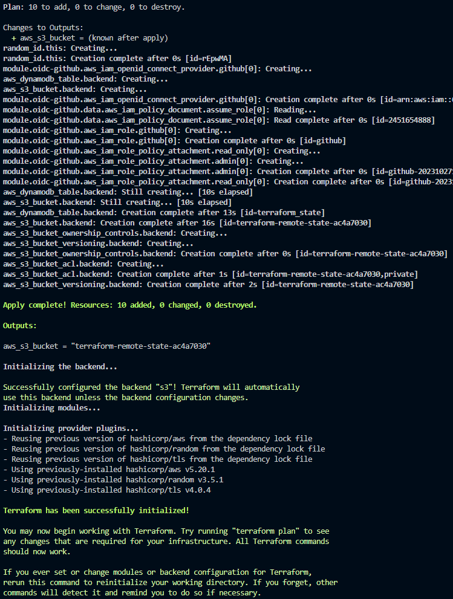

# tf-bootstrap

[](https://github.com/chadwickcloudservices/tf-bootstrap/actions/workflows/linting.yml)
[](https://opensource.org/licenses/Apache-2.0)

Prepares an AWS account for Terraform remote state management and GitHub Actions OpenID Connect

### Assumptions

- You have the proper permissions to deploy the referenced resources in your AWS account
- You have the version of Terraform and AWS CLI referenced in the [Requirements](https://github.com/chadwickcloudservices/tf-bootstrap#requirements) section

### Usage

1. [Establish AWS CLI authentication]
2. Clone this repository and navigate to the root
3. Execute the  deploy-tf.sh script with the '-p' flag
```bash
./deploy-tf.sh -p

# After the s3 bucket is created, the local state file will be moved to the s3 bucket
```
4. The AWS account is now ready to properly store Terraform state files
5. You can return the AWS S3 bucket name using either of the below commands
```bash
# aws cli
aws s3 ls | grep terraform-remote-state | cut -d " " -f 3

or

# terraform cli
terraform output -raw aws_s3_bucket
```
6. deploy-tf.sh full functionality
```bash
# 'p' flag is used for initial deployment
./deploy-tf.sh -p

# 'f' flag is used by GitHub Actions to terraform fmt
./deploy-tf.sh -f

# 'u' flag is used to prepare the main.tf file for existing deployments
./deploy-tf.sh -u
```

### Example Output



### Requirements

| Name                                                                                     | Version  |
| -----------------------------------------------------------------------------------------|----------|
| [aws provider](https://registry.terraform.io/providers/hashicorp/aws/latest/docs)        | ~> 5.20  |
| [terraform](https://developer.hashicorp.com/terraform/downloads)                         | ~> 1.5.7 |
| [aws cli](https://docs.aws.amazon.com/cli/latest/userguide/getting-started-install.html) | ~> 2.7   |

### Resources

| Name                                                                                                                                                 | Type        |
| ---------------------------------------------------------------------------------------------------------------------------------------------------- | ----------- |
| [aws_dynamodb_table.backend](https://registry.terraform.io/providers/hashicorp/aws/latest/docs/resources/dynamodb_table)                             | resource    |
| [aws_s3_bucket.backend](https://registry.terraform.io/providers/hashicorp/aws/latest/docs/resources/s3_bucket)                                       | resource    |
| [aws_s3_bucket_acl.backend](https://registry.terraform.io/providers/hashicorp/aws/latest/docs/resources/s3_bucket_acl)                               | resource    |
| [aws_s3_bucket_ownership_controls.backend](https://registry.terraform.io/providers/hashicorp/aws/latest/docs/resources/s3_bucket_ownership_controls) | resource    |
| [aws_s3_bucket_versioning.backend](https://registry.terraform.io/providers/hashicorp/aws/latest/docs/resources/s3_bucket_versioning)                 | resource    |
| [random_id.this](https://registry.terraform.io/providers/hashicorp/random/latest/docs/resources/id)                                                  | resource    |

### External Modules

| Name | Version |
| ------------------------------------------------------------------------------------|-------|
| [oidc-github](https://registry.terraform.io/modules/unfunco/oidc-github/aws/latest) | 1.6.0 |

### References

 - [Terraform Backend S3]
 - [GitHub Actions]

### License

© 2023 [Brian Chadwick](https://github.com/chadwickcloudservices)
Made available under the terms of the [Apache License 2.0].

[terraform backend s3]: https://developer.hashicorp.com/terraform/language/v1.5.x/settings/backends/s3
[github actions]: https://docs.github.com/en/actions/quickstart
[Establish AWS CLI authentication]: https://docs.aws.amazon.com/cli/latest/userguide/cli-chap-authentication.html